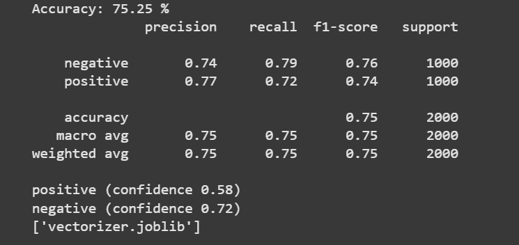

# Twitter Sentiment Analysis 🐦💬

A beginner-friendly machine learning project that performs **sentiment analysis** on Twitter text data using **Logistic Regression**.

---

## 📌 Project Overview
- Preprocesses raw Twitter text (remove stopwords, punctuation).
- Converts text into numerical features using **Bag-of-Words (CountVectorizer)**.
- Trains a **Logistic Regression model** for classification.
- Evaluates performance with accuracy score.

---

## 🛠️ Tech Stack
- Python 🐍  
- Scikit-learn  
- Pandas, NumPy  
- Matplotlib (for visualization, optional)

---

## 🚀 How to Run
1. Clone this repository:
   ```bash
   git clone https://github.com/Badriii2502/sentiment-analysis-twitter.git


2. Install dependencies:
   pip install -r requirements.txt
   jupyter notebook sentiment_twitter_basics.ipynb

## 📊 Results

The sentiment analysis model was evaluated on 2000 tweets (1000 positive, 1000 negative).

- **Accuracy:** 75.25%  
- **Precision (Negative):** 0.74  
- **Recall (Negative):** 0.79  
- **F1-score (Negative):** 0.76  
- **Precision (Positive):** 0.77  
- **Recall (Positive):** 0.72  
- **F1-score (Positive):** 0.74  

### Classification Report



## ⚙️ Model Output Explanation

The model achieved an **accuracy of ~75.25%**.  
Here’s what the output means:

- **Accuracy (75%)** → Out of all tweets, 75% are correctly classified.  
- **Precision** → When the model predicts *positive/negative*, how often is it correct?  
- **Recall** → Of all *actual* positive/negative tweets, how many did the model catch?  
- **F1-score** → Balance between precision & recall.  
- **Support** → Number of test samples (1000 positive + 1000 negative).  

The model also gives a **confidence score** for each new input (e.g., *positive confidence 0.58*).

---

## 🔮 Next Steps / Improvements

Although the model achieves **~75% accuracy**, there is room for improvement. Some possible enhancements include:  

1. **Larger Dataset** – Train on a bigger and more diverse dataset beyond the NLTK Twitter samples.  
2. **Hyperparameter Tuning** – Experiment with vectorizer options and classifier parameters.  
3. **Deep Learning Models** – Try LSTM, GRU, or BERT for better performance.  
4. **Neutral Sentiment** – Extend the model to classify *neutral* tweets.  
5. **Deployment** – Build a Flask/Streamlit app for live predictions.  
6. **Visualization** – Add graphs (class distribution, confusion matrix, etc.).  

---


## 🙋 About Me
I’m Badrinarayan B, a 3rd year B.Tech student (CSBS) at SRMIST Ramapuram.  
🔗 [Connect with me on LinkedIn](https://www.linkedin.com/in/badrinarayan-b-4a87a6293/)


